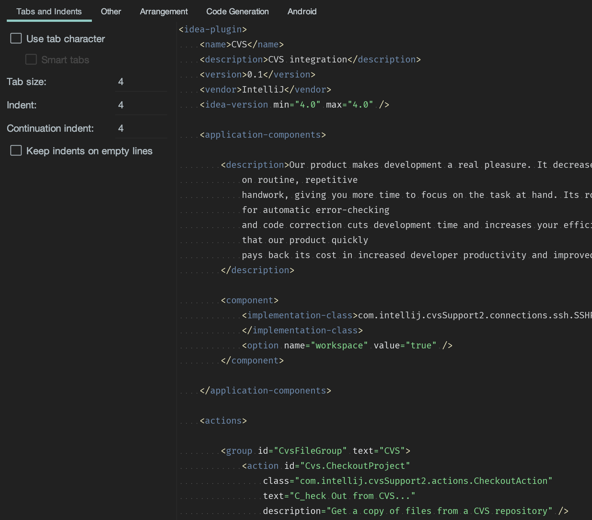
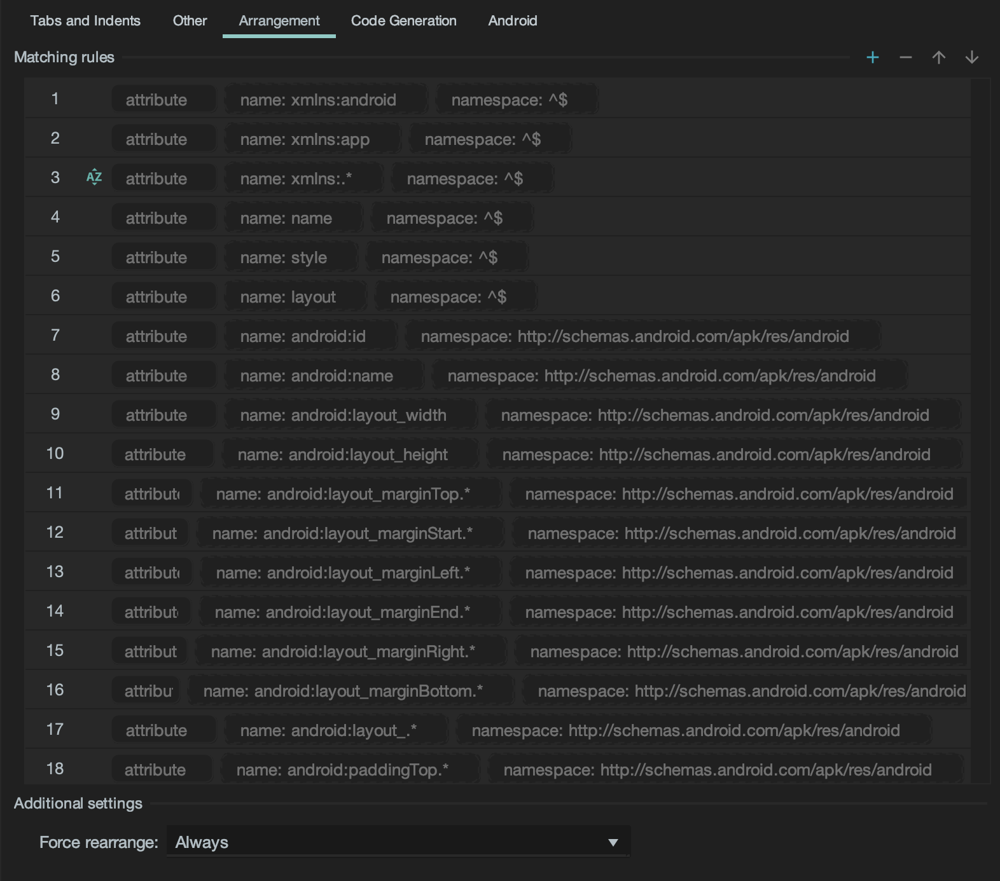
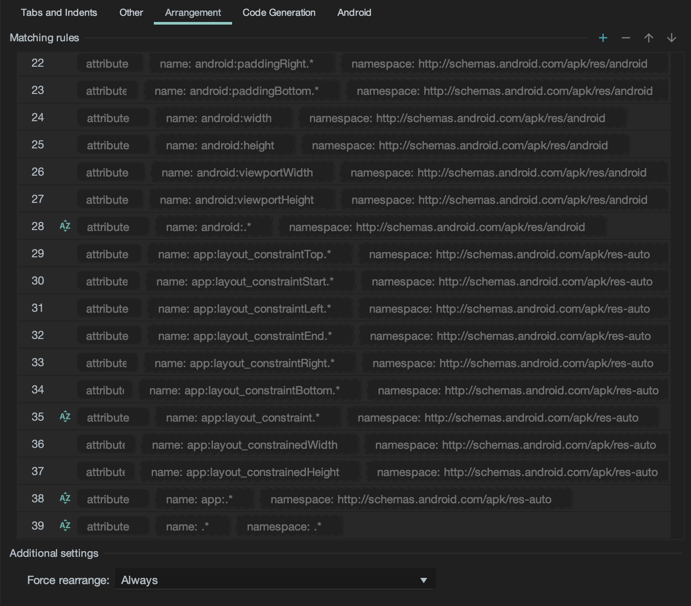
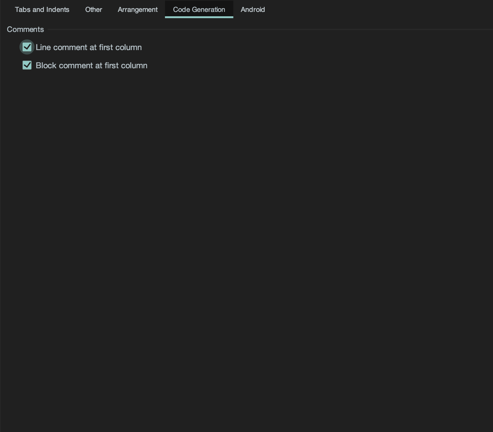

# Android Style Guide

Style Guide for Android Developers


## Getting Started

1. Download [CodeStyle.xml](./CodeStyle.xml)
2. AndroidStudio > Preferences > Editor > CodeStyle > Scheme > ... > Import Scheme
3. Select downloaded `CodeStyle.xml` 
4. OK to apply


## Kotlin

[Kotlin Coding Convention](https://kotlinlang.org/docs/reference/coding-conventions.html) 설정을 기본으로 합니다.

### Line Spacing

한 줄은 **140자**를 초과하지 않습니다.

- Argument가 많다면, 한줄에 하나의 Argument만 적어주세요 (Chop down if long).

```kotlin
...
import com.rainist.banksalad2.R


data class Rainist(
    careerPageUrl: String,
    banksaladPlayStoreUrl: String
)

val rainist = Rainist(
    "https://career.banksalad.com/",
    "https://play.google.com/store/apps/details?id=com.rainist.banksalad2"
)
```


### Function / Property

Argument 없는 function이 다음 조건을 모두 만족한다면, function 대신 property를 사용합니다.

If a function is/does...

- does not throw Exception
- is O(1) complexity
- is cheap or its computation result is being cached
- is idempotent operation

```kotlin
// Use Property
fun getMaxHeight(): Int = toolbar.height + someTextView.height // (X)
val maxHeight: Int = toolbar.height + someTextView.height // (O)

// Use Function
@Throws(TextViewNotFoundException::class)
fun filterTextViews(views: List<View>): List<View> {
    val textViews = views.filterIsInstance<TextView>()
    if (textViews.isEmpty()) {
        throw TextViewNotFoundException()
    }
    return textViews
}
```


### Network Request / Response

`:data` 레이어의 Network Response 객체는 다음 구조로 작성되어야 합니다.

```kotlin
data class SampleResponse(
    @SerializedName("id")
    val id: String, 
    @SerializedName("name")
    val name: String
): Response {
    companion object {
        val toEntity: Sample = Sample(id)
    }
}
```


### enum class

Response에 enum이 포함되어 있다면, `value` property를 만들고, Response 값으로 초기화 합니다.
Raw String을 Mapping해주는 Extension Function을 `:data` 레이어에 추가합니다.

```kotlin
// Entity Layer
enum class DeletedStatus(val value: String) {
    NORMAL("normal"),
    DELETED("deleted"),
    ;
 
    companion object {         
        fun from(rawValue: String): DeletedStatus =
            values().find { it.value == rawValue }!!
    }
}
 
// Data Layer
fun DeletedStatus.from(rawValue: String): DeletedStatus =
    values().find { it.value == rawValue }
```


### apply / run / with / let / also

Reference from [Kotlin Scoping Functions apply vs. with, let, also, and run](https://medium.com/@fatihcoskun/kotlin-scoping-functions-apply-vs-with-let-also-run-816e4efb75f5)


특정 객체가 **복수로 사용되는 경우**에서만 사용합니다.

**apply 사용 규칙**

- 수신 객체 람다 내부에서 수신 객체의 함수를 사용하지 않고 수신 객체 자신을 다시 반환 하려는 경우에 apply 를 사용합니다.

- 수신 객체 의 프로퍼티 만을 사용하는 대표적인 경우가 객체의 초기화 이며, 이곳에 apply 를 사용합니다.

```kotlin
val peter = Person().apply {
    // apply 의 블록 에서는 오직 프로퍼티 만 사용합니다!
    name = "Peter"
    age = 18
}
```

**also 사용 규칙**

- 수신 객체 람다가 전달된 수신 객체를 전혀 사용 하지 않거나 수신 객체의 속성을 변경하지 않고 사용하는 경우 also 를 사용합니다.
- also 는 apply 와 마찬가지로 수신 객체를 반환 하므로 블록 함수가 다른 값을 반환 해야하는 경우에는 also 를 사용할수 없습니다.
- 예를 들자면, 객체의 사이드 이팩트를 확인하거나 수신 객체의 프로퍼티에 데이터를 할당하기 전에 해당 데이터의 유효성을 검사 할 때 매우 유용합니다.

```kotlin
class Book(author: Person) {
    val author = author.also {
      requireNotNull(it.age)
      print(it.name)
    }
}
```

**with 사용 규칙**

- Non-nullable (Null 이 될수 없는) 수신 객체 이고 결과가 필요하지 않은 경우에만 with 를 사용합니다.

```kotlin
val person: Person = getPerson()
with(person) {
    print(name)
    print(age)
}
```

**run 사용 규칙**

- 어떤 값을 계산할 필요가 있거나 여러개의 지역 변수의 범위를 제한하려면 run 을 사용합니다.
- 매개 변수로 전달된 명시적 수신객체 를 암시적 수신 객체로 변환 할때 run ()을 사용할수 있습니다.

```kotlin
val inserted: Boolean = run {
    // person 과 personDao 의 범위를 제한 합니다.
    val person: Person = getPerson()
    val personDao: PersonDao = getPersonDao()
    // 수행 결과를 반환 합니다.
    personDao.insert(person)
}
fun printAge(person: Person) = person.run {
    // person 을 수신객체로 변환하여 age 값을 사용합니다.
    print(age)
}
```

**여러 범위 지정 함수 결합**

- 코드 가독성을 향상시키기 위해 범위 지정 기능을 분리하여 어떻게 사용할 수 있는지 보여주었습니다. 하나의 코드 블록 내에서 여러 범위 지정 함수를 중첩 하려는 경우가 종종 있습니다. 그러나 범위 지정 함수가 중첩되면 코드의 가독성이 떨어지고 파악하기 어려워 집니다.
- **원칙적으로 중첩은 하지 않는 것이 좋습니다.** 수신객체 지정 람다 에 수신 객체가 암시적으로 전달되는 apply, run, with 는 중첩하지 마십시오.
- 이 함수들은 수신 객체를 this 또는 생략하여 사용하며, 수신객체의 이름을 다르게 지정할수 없기 때문에 중첩될 경우 혼동 하기 쉬워집니다.
- also 와 let 을 중첩 해야만 할때는 암시적 수신 객체 를 가르키는 매개 변수 인 it 을 사용하지 마십시오. 대신 명시적인 이름을 제공하여 코드 상의 이름이 혼동되지 않도록 해야 합니다.

**Chaning Method로 범위 지정 함수 결합**

좋은 예

```kotlin
private fun insert(user: User) = SqlBuilder().apply {
  append("INSERT INTO user (email, name, age) VALUES ")
  append("(?", user.email)
  append(",?", user.name)
  append(",?)", user.age)
}.also {
  print("Executing SQL update: $it.")
}.run {
  jdbc.update(this) > 0
}
```


### if / else

- `if` `else` 표현식 각각이 한 줄로 처리될 수 없다면 괄호로 감싸 블록을 만들어 줍니다.

- `if ~ else` 표현식을 통틀어 한 줄로 처리할 수 있는 경우에는 inline 으로 작성합니다.
- `if` 표현식이 블록으로 처리되었더라도, `else` 표현식을 한 줄로 처리할 수 있는 경우에는 inline 으로 작성합니다.

```kotlin
// Good
if (condition) ifExpression else elseExpression

// Good
if (condition) {
  ifBlockExpression
} else {
  elseBlockExpression
}

// Good
if (condition) {
  ifBlockExpression1
  ifBlockExpression2
} else {
  elseBlockExpression1
  elseBlockExpression2
}

// OK
if (condition) {
  ifBlockExpression1
  ifBlockExpression2
} else elseExpression

// Not Good
if (condition) ifExpression
else {
  elseBlockExpression1
  elseBlockExpression2
}
```


### when

한 줄일 경우에는 inline 하고, 여러 줄인 경우에는 `{}` Block을 이용합니다.

```kotlin
when (condition) {
    caseExpression1 -> inlineExpression1
    someLongCaseExpression2 -> inlineExpression2
    caseExpression3 -> {
        multiLineExpression3_1
        multiLineExpression3_2
        multiLineExpression3_3
    }
}
```


### Intent

Intent를 생성하는 함수명은 `getIntent()`로 생성합니다.
`Activity` 등 화면 전환 동작을 하는 함수명에는 `start` 접두사를 붙입니다.


## XML

XML Style은 AndroidStudio 기본 XML 스타일을 기본으로 합니다.

### Arrangement

XML 태그 내의 각 속성들은 자동 정렬 적용 시 다음과 같은 순서로 배치됩니다:
**`SORT_BY_NAME`** 이 적혀진 항목은 해당 조건 내에서 Alphabetical Sort 처리됩니다.

1. `xmlns:android`
1. `xmlns:app`
1. **`SORT_BY_NAME`** `xmlns:.*`
1. `name`
1. `style`
1. `layout`
1. `android:id`
1. `android:name`
1. `android:layout_width`
1. `android:layout_height`
1. `android:layout_marginTop.*`
1. `android:layout_marginStart.*`
1. `android:layout_marginLeft.*`
1. `android:layout_marginEnd.*`
1. `android:layout_marginRight.*`
1. `android:layout_marginBottom.*`
1. `android:layout_.*`
1. `android:paddingTop.*`
1. `android:paddingStart.*`
1. `android:paddingLeft.*`
1. `android:paddingEnd.*`
1. `android:paddingRight.*`
1. `android:paddingBottom.*`
1. `android:width`
1. `android:height`
1. `android:viewportWidth`
1. `android:viewportHeight`
1. **`SORT_BY_NAME`** `android:.*`
1. `app:layout_constraintTop.*`
1. `app:layout_constraintStart.*`
1. `app:layout_constraintLeft.*`
1. `app:layout_constraintEnd.*`
1. `app:layout_constraintRight.*`
1. `app:layout_constraintBottom.*`
1. **`SORT_BY_NAME`** `app:layout_constraint.*`
1. `app:layout_constrainedWidth`
1. `app:layout_constrainedHeight`
1. **`SORT_BY_NAME`** `app:.*`
1. **`SORT_BY_NAME`** `.*`


### Snapshot











### View ID

`android:id` suffix는 해당 View Type을 사용합니다.

```xml
<TextView
    android:id="@+id/welcomeTextView"
    .../>
```


## Java

We don't. Use Default StyleGuide shipped with AndroidStudio


